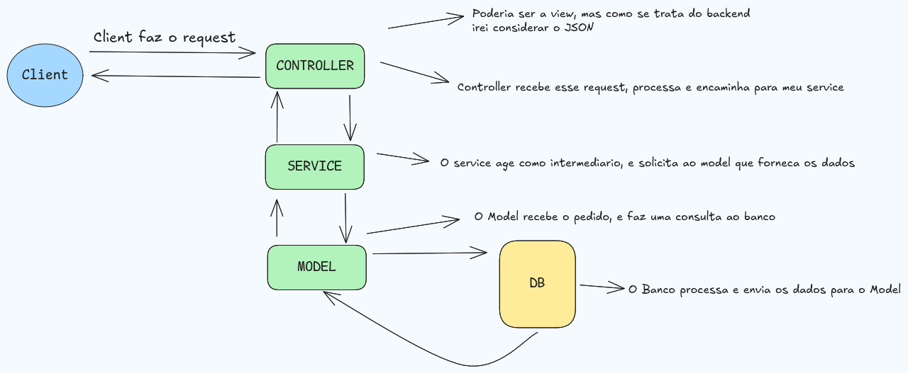

## ITicket - Documentation

leia sobre o requeriments do desafio aqui: 

### Minha Proposta de Arquitetura - MVC

no caso como se trata de uma application backend, "troquei" a view pelo service, um pattern proposto por Martin Flower.

A camada service age como se fosse um intermediário entre meu model e meu controller, gerenciando minha regra de negócio e separando essa responsabilidade que poderia ser do model e/ou controller, o que naturalmente teria um problema de acoplamento excessivo.

---
### Author 

- @johnnreis